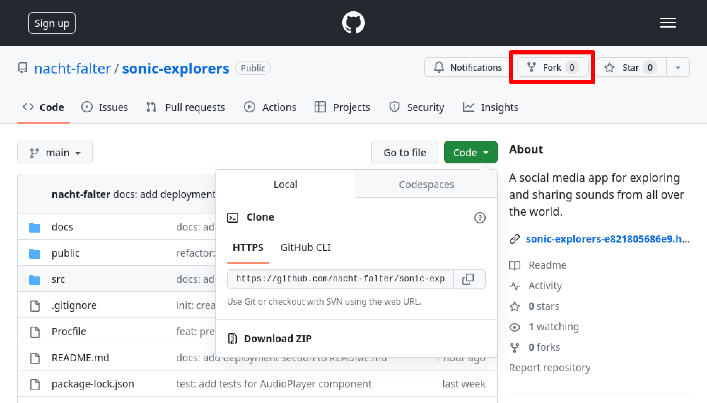
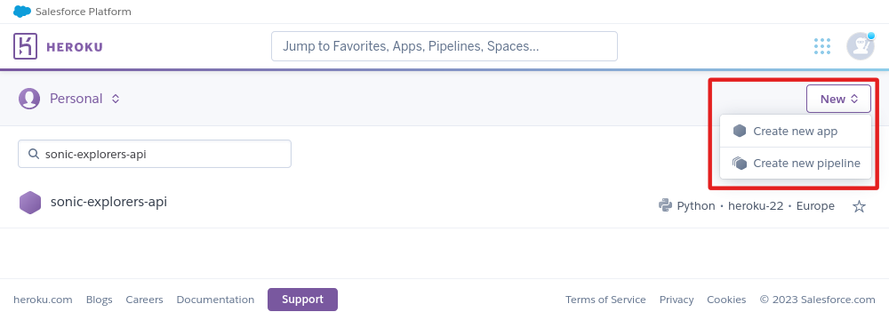
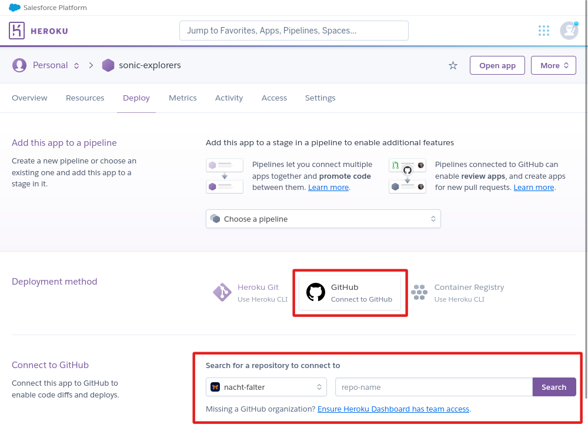
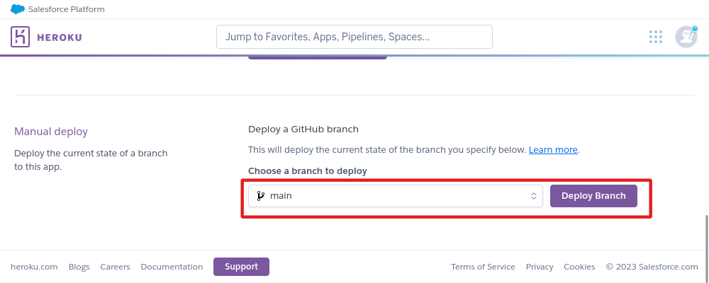
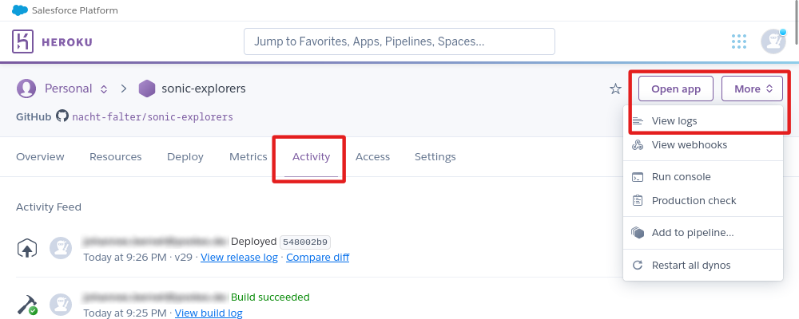
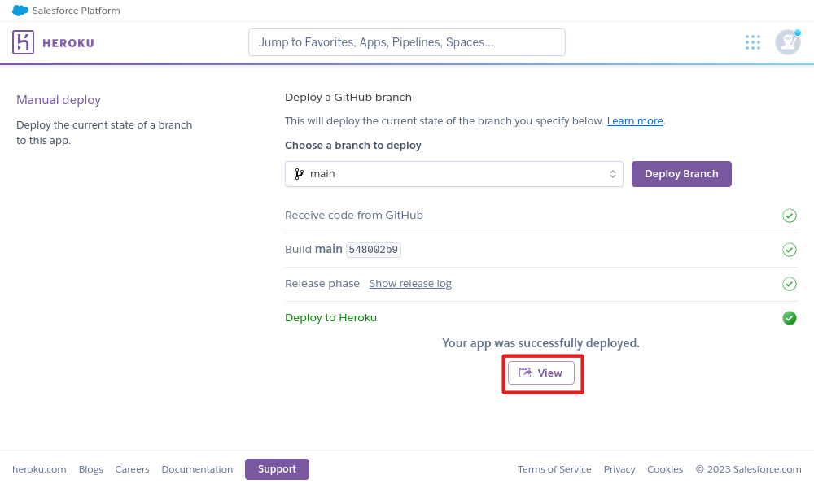

# Sonic Explorers: Listen, Share, Connect 🌎🎙️

**Sonic Explorers** is a social media app dedicated to recording and sharing sounds.

In a world saturated with images and visual content, the sounds that surround us often go unnoticed, unless they are too loud or disruptive.
**Sonic Explorers** encourages you to open up your ears and sharpen your awareness of the diverse sounds of the world.
Whether you find yourself in the busy streets of a large city or enjoying the calm serenity of nature, record the sounds you encounter and share your sonic treasures with your friends and followers.

**Key features:**

- **User Accounts & Profiles**: Create an account and customize your profile.
- **Sound Upload with Geolocation**: Share your sounds and add location data.
- **Tagging System**: Organize your sounds with tags.
- **Search for Sounds**: Find sounds by title, description, user, or tag.
- **Sound Map View**: Explore all sounds on a map.
- **User Interactions**: Like and comment on sounds, follow users you like.
- **Notifications**: Stay updated on user interactions and new content.
- **Report Inappropriate Content**: Help make the app a safe space for everyone.

The deployed application can be found here: [Sonic Explorers](https://sonic-explorers-e821805686e9.herokuapp.com/)

## Table of Contents

...

## Features

### Existing Features

- **User authentication and profiles**: Users can create an account, log in and log out. They can customize their profile by adding a profile picture and a short bio.
- **Sound upload with geolocation**: Users can upload sounds and add location data. They can also edit and delete their sounds.
- **Tagging system**: Users can add tags to their sounds.
- **Sound list view with infinite scroll**: Users can see lists of sounds (all sounds, sounds by followed users, liked sounds). For better performance, the lists are paginated, and additional sounds are loaded when the user scrolls to the bottom of the page.
- **Sound search**: Users can search for sounds by title, description, user, or tag.
- **Sound map view**: Users can view all sounds on a map.
- **User interactions**: Users can like and comment on sounds. They can also follow other users.
- **Notifications**: Users receive notifications for new likes and comments on their sounds, and for new sounds by users they follow. Staff users receive notifications for new reports.
- **Reporting inappropriate content**: Users can report inappropriate content.

#### User Authentication

- Signed-out users can see a list of all sounds and search for sounds, and explore the sound map. To use the other features of the app, they need to create an account and sign in.

- After signing in, users can access their feed, their liked sounds, and their notifications from the bottom navigation bar.
- Users can also upload sounds by clicking on the upload button in the top navigation bar.

#### User Profiles

- Signed-in users can click on their username in the top navigation bar to access their profile.
- Users can edit their profile by clicking on the menu button in the top-right corner of the profile page.
- Additionally, they can change their username and password by clicking on the corresponding buttons on the profile page dropdown menu.
- Users can follow other users by clicking on the Follow button on their profile page or in the *Popular Explorers* widget (only available on larger screens).

#### Sound Upload

- Users can upload sounds by clicking on the upload button in the top navigation bar.
- On the sound upload page, users can upload a sound file and add a title, description, location data, tags, and an image to their sound.
- Users can listen to their sound before uploading it by clicking on the play button.
- Location data can be added automatically if the user grants the application access to their current location. Alternatively, users can pick a location on a map.
- Users can add up to 15 tags to their sound by entering them as comma-separated values.
- After submitting the form, the user will be redirected to the sound detail page, which can also be accessed by clicking on a sound's title.

#### Editing and Deleting Sounds

- Users can edit and delete their sounds by clicking on the dropdown menu button on the sound detail page.
- Users can also report inappropriate sounds for inappropriate content by clicking on the report button on the sound detail dropdown menu.

#### Comments and Likes

- Signed-in users can comment on sounds by submitting the comment form on the sound detail page.
- New comments will appear underneath the sound detail and can be edited or deleted by clicking on the link in the comment dropdown menu.
- The number of comments will appear underneath the sound's details.
- Users can like sounds by clicking on the heart icon on the sound detail page.

#### Reports

- Staff users can access all reports by clicking on the reports link in the user dropdown menu in the top navigation bar.
- Staff users will also receive a notification when a new report is submitted.
- Staff users can review reports and mark them as closed from the reports page.
- If non-staff users try to access the reports page by entering the URL in the browser, they will see an *access denied* message.

### Future Features

The following features have not been included in the current scope of the project, but might be added in the future:

- Users can record sounds directly in the browser instead of uploading pre-recorded sounds.
- Provide users with basic sound editing functionality like trimming, fading, etc.
- Users can search for sounds by address, city, country, or continent.
- Users can reply to comments.
- Users can send private messages to other users.
- Users can set their sounds to private or make them available only to their followers.
- Staff users can delete inappropriate content and block users.
- Gamification features:
    - Challenges for finding and recording specific sounds or going to specific places.
    - Users can earn badges for certain achievements (e.g., number of sounds uploaded, number of likes, completing challenges).

## Design Process

I approached the design process of the *Sonic Explorers* app from a user-centered perspective, following the five planes of user experience. The design process of the frontend application had to go hand in hand with the design process of the backend API, which is documented here: [Sonic Explorers API Design Process](https://github.com/sonic-explorers/sonic-explorers-api#design-process).

### Strategy Plane

*Sonic Explorers* is a social media app dedicated to recording and sharing sounds. It's target audience are people who are interested in sound and want to share their experiences with others. Its main goal is to provide a playful and engaging way of encouraging a more conscious approach to the sounds in our environment.

The use of geolocation and maps is an essential part of the application. Due to the ephemeral nature of sound, recordings often feel disconnected from the original situation in which they were recorded. Adding location data to a sound can help to link sound recordings to real places and situations, which makes it easier for users to relate to them. At the same time, placing sounds on a map allows users to explore sounds from different places and discover new sounds around them. It also encourages users to get out and explore interesting sounds in the world.

Tagging sounds is another important feature of the application. It allows users to organize and find sounds. It also encourages users to think about the acoustic qualities of the sounds they encounter and to reflect on them. Although it can be quite challenging to find appropriate words to describe a sound, other than just naming the sound's source, thinking about this can be a first step to a more conscious approach to sound.

The social interaction features of the application (following other users, liking and commenting on sounds) are intended to encourage users to engage with each other and to create a community of people who are interested in sound.

### Scope Plane

For the scope of the project, separate sets of user stories were created [for the backend](https://github.com/nacht-falter/sonic-explorers-api/blob/main/docs/USERSTORIES.md) and [for the frontend](docs/USERSTORIES.md) part of the application with the MVP (Minimum Viable Product) in mind.

The following user stories were included in the current scope of the frontend project. User stories for the MVP are marked with the MVP label.

...

### Structure Plane

The planning of the structure plane of the project involved thinking about the different parts of the project and their interactions. Since most of that planning had to be done before implementing the backend part of the project, the process of planning the structure of the backend (database, models, API endpoints) is documented here: [Sonic Explorers API Design Process](https://github.com/nacht-falter/sonic-explorers-api#design-process).

The structure of the frontend application was guided by the features provided by the backend API. In order to implement all features within the current scope of the project, I planned the frontend application with the following main components:

- Two navigation bars (top and bottom)
- Pages for user authentication (sign up, sign in)
- Pages for listing sounds, notifications, and reports
- Forms for uploading and editing sounds
- Pages for displaying and editing user profiles
- A page for displaying sound details
- A component for displaying a map with all sounds
- Components for displaying profiles, sound details, comments, notifications, and reports
- Forms for creating and editing profiles, comments, and reports and for changing usernames and passwords
- An audio player for listening to sounds

Additional components were added during the development process as needed.

### Skeleton Plane

The layout of the application was designed with a mobile-first approach, since it is intended to be mainly used as a mobile application. But it is also designed to be fully responsive and can be used on all screen sizes.

The user interface of the application consists of three main sections:

- A top navigation bar including the following elements:
    - The Sonic Explorers logo (and the title on larger screens)
    - Sign-up and sign-in links for signed-out users
    - A sound upload button and a user dropdown menu for signed-in users
- A bottom navigation bar with links to the main pages of the application (Explore, Map, Feed, Favourites, News)
- A content section for displaying the contents of the current page

Originally, the user interface of the application was planned with a dropdown navigation menu at the top of the page, as can be seen on the wireframes below. During the development process, I decided to use a bottom navigation bar for the main pages of the application to make the application more mobile-friendly and make it feel more like a mobile app rather than a website. This decision is not reflected in the wireframes.

Show wireframes for Mobile

Show wireframes for Desktop

### Surface Plane

#### Logo

The first step of planning for the surface plane was to design a logo for the application. After playing around with different ideas, I settled on a circle divided in two halves by a jagged line, which looks like a soundwave but also like a mountain range, representing the sound aspect as well as the exploratory aspect of the application. I chose pink and yellow as the main colors of the logo. 

#### Colors

In accordance with the application logo, the main colors of the application used for links, buttons and other elements are pink and yellow.

<!-- Display colors in markdown: https://stackoverflow.com/a/41247934 -->
 Primary color: #d939ab

 Secondary color: #ffc101

#### Fonts

I chose [Open Sans](https://fonts.google.com/specimen/Open+Sans) as the main font for the application for its clean look and good legibility. It is used for all text elements on the page except for headings.

For headings, I chose [Exo 2](https://fonts.google.com/specimen/Exo+2), which has a more playful and futuristic look.

## Agile Methodology

### GitHub Issues and Projects as Agile Tools

[GitHub Issues](https://docs.github.com/en/issues) and [GitHub Projects](https://docs.github.com/en/issues/planning-and-tracking-with-projects/learning-about-projects/about-projects) were used as tools for Agile methodology.

- I used [Issues](https://github.com/nacht-falter/sonic-explorers/issues?q=is%3Aissue+is%3Aclosed) to define user stories and created Assessment Criteria and Tasks for each user story.

- I categorized all user stories by **[Themes](https://github.com/nacht-falter/sonic-explorers/labels?q=THEME)** and **[Epics](https://github.com/nacht-falter/sonic-explorers/labels?q=EPIC)** and used labels to mark user stories accordingly.

- All user stories were prioritized using the MoSCoW prioritization technique with the following project-wide priorities:

  https://github.com/nacht-falter/sonic-explorers/labels/PRIORITY%3A%20Must-Have https://github.com/nacht-falter/sonic-explorers/labels/PRIORITY%3A%20Should-Have https://github.com/nacht-falter/sonic-explorers/labels/PRIORITY%3A%20Could-Have https://github.com/nacht-falter/sonic-explorers/labels/PRIORITY%3A%20Won%27t-Have

- I used **Milestones** for the [Product Backlog](https://github.com/nacht-falter/sonic-explorers/milestone/1) and for adding user stories to [Sprints](https://github.com/nacht-falter/sonic-explorers/milestones?state=closed).

- [Projects](https://github.com/nacht-falter/sonic-explorers/projects?query=is%3Aclosed) were used for tracking user stories within each iteration.

- [Project workflows](https://docs.github.com/en/issues/planning-and-tracking-with-projects/automating-your-project/adding-items-automatically) were used to automatically add user stories in a sprint to the To-do column of the corresponding project board.

- For sprint-wide prioritization, a [custom priority field](https://docs.github.com/en/issues/planning-and-tracking-with-projects/understanding-fields) was created.

### Sprint Planning

The development process for the API project was planned with six timeboxed sprints of three days each. User stories were assigned to sprints with the MVP in mind, while making sure not to assign more than 60% Must-Have user stories to a sprint.

#### Sprint 1 (Sept. 27 to 29 2023)

Show sprint details

##### To-do:

- Initial Setup
- User registration and authentication
- Navigation
- Messages

Finished on Sept. 29 2023, two unfinished items moved back to product backlog.

[Sprint User Stories](https://github.com/nacht-falter/sonic-explorers/milestone/2?closed=1) | [Sprint Project Board](https://github.com/users/nacht-falter/projects/19)

#### Sprint 2 (Oct. 1 to 3 2023)

Show sprint details

##### To-do:

- Sound upload
- Adding sound details
- Geolocation data
- Bugfixes

Finished on Oct. 3 2023, two unfinished items moved back to product backlog.

[Sprint User Stories](https://github.com/nacht-falter/sonic-explorers/milestone/3?closed=1) | [Sprint Project Board](https://github.com/users/nacht-falter/projects/20)

#### Sprint 3 (Oct. 3 to 5 2023)

Show sprint details

##### To-do:

- Audio player
- Sound lists
- Infinite scroll
- Sound detail page
- Liking and unliking sounds
- Deleting sounds
- Bug fixes

Finished on Oct. 5 2023, one unfinished item moved back to product backlog.

[Sprint User Stories](https://github.com/nacht-falter/sonic-explorers/milestone/4?closed=1) | [Sprint Project Board](https://github.com/users/nacht-falter/projects/21)

#### Sprint 4 (Oct. 6 to 9 2023)

Show sprint details

##### To-do:

- Edit sound information
- Commenting on sounds
- Editing and deleting comments
- Follow/unfollow users
- Profile page
- Edit profile
- Reading and deleting notifications

Finished on Oct. 9 2023, two unfinished items moved back to product backlog.

[Sprint User Stories](https://github.com/nacht-falter/sonic-explorers/milestone/5?closed=1) | [Sprint Project Board](https://github.com/users/nacht-falter/projects/22)

#### Sprint 5 (Oct. 10 to 13 2023)

Show sprint details

##### To-do:

- Map view
- Creating, reading, and deleting reports
- Responsive layout fixes
- Testing and Documentation

Finished on Oct. 10 2023, one item re-prioritized as "Won't have" moved back to product backlog.

[Sprint User Stories](https://github.com/nacht-falter/sonic-explorers/milestone/6?closed=1) | [Sprint Project Board](https://github.com/users/nacht-falter/projects/23)

#### Sprint 6 (Oct. 20 to 24)

Show sprint details

##### To-do:

- Testing
- Bug fixes
- Documentation

Could not be completed within the planned time frame due to familial obligations. Finished on Nov. 6. 

## Technologies Used

### Frameworks and Languages

The application was built with [React](https://reactjs.org/), a frontend JavaScript library. The React project was initialized with [Create React App](https://create-react-app.dev/).

### Additional JavaScript and React Libraries

- [Axios](https://axios-http.com/) for making HTTP requests to the API.
- [Bootstrap](https://getbootstrap.com/) and [React Bootstrap](https://react-bootstrap.github.io/) for styling and layout.
- [React Router](https://reactrouter.com/en/main) for routing.
- [React Infinite Scroll Component](https://www.npmjs.com/package/react-infinite-scroll-component) for implementing infinite scroll.
- [JWT Decode](https://www.npmjs.com/package/jwt-decode) for decoding JSON Web Tokens.
- [Leaflet](https://leafletjs.com/) and [React Leaflet](https://react-leaflet.js.org/) for displaying maps.
- [WaveSurfer.js](https://wavesurfer.xyz/) for playing audio and generating waveforms.
- [Jest](https://jestjs.io/) and [React Testing Library](https://testing-library.com/docs/react-testing-library/intro/) for automated testing.

### Other Software

- [GitHub](https://github.com/) is used to store all project files in the [repository](https://github.com/nacht-falter/sonic-explorers)
- [GitHub Issues](https://docs.github.com/en/issues) have been used for Agile methodology by assigning user stories to issues and using labels to organize user stories.
- [GitHub Projects](https://docs.github.com/en/issues/planning-and-tracking-with-projects/learning-about-projects/about-projects) have been used for Agile sprint planning and task tracking.
  [The project boards for all sprints can be found here](https://github.com/nacht-falter/sonic-explorers/projects?query=is%3Aclosed).
- The [GitHub CLI](https://cli.github.com/) was used for creating issues from the terminal.
- [Git](https://git-scm.com/) was used for version control by committing changes to Git and pushing them to GitHub from the command line.
- [Heroku](https://heroku.com/) is used to [deploy the application](#deployment).
- [Neovim](https://neovim.io/) was used for writing code.
- [Pixelmator Pro](https://www.pixelmator.com/pro/) and [GIMP](https://www.gimp.org/) were used for image editing.
- https://derlin.github.io/bitdowntoc/ has been used to create the [table of contents](#table-of-contents) in this README.

## Testing

...

## Deployment

The application was deployed to [Heroku](https://heroku.com). A live version of the application can be found at https://sonic-explorers-e821805686e9.herokuapp.com/.

Please follow these steps to deploy the application:

1. Deploy your own version of the [Sonic Explorers API](https://github.com/nacht-falter/sonic-explorers-api) by following the [deployment instructions for the Sonic Explorers API](https://github.com/nacht-falter/sonic-explorers-api#deployment).

2. Clone or fork this repository. For forking it, go to https://github.com/nacht-falter/sonic-explorers/, click on `Fork` and follow the instructions. For cloning the repository, run `git clone https://github.com/nacht-falter/sonic-explorers.git` in your terminal.

    

    
Show image

    

    

3. Go to the repository folder and edit the file `src/api/axiosDefaults.js`. In the file, change the value of `axios.defaults.baseURL` to the URL of your deployed API. You can find the URL by clicking on your API app from the Heroku dashboard and then copying the URL from the `Open app` button.

4. If you haven't done so yet, login to your Heroku account at https://heroku.com. Now start a new app from the [Heroku dashboard](https://dashboard.heroku.com) by clicking on `New` and then on `Create new app`.

    

    
Show image

    

    

5. Give your app an available name and choose your region (US or Europe).

8. Click on the *Deploy* tab and connect the Heroku app to your GitHub repository.

    

    
Show image

    

    

9. Scroll down and select the branch you want to deploy in the *Manual deploy* section. Now click on `Deploy Branch` for the first deployment of the application.

    

    
Show image

    

    

10. In case you run into any issues while deploying your App you can access Heroku logs by clicking on `More` and then `View logs` or you can check the *Activity* tab for debugging.

    

    
Show image

    

    

11. After successful deployment, click on `View` to open your deployed app.

    

    
Show image

    

    

    If everything went well, you should see the *Sonic Explorers* landing page. If you can see the landing page but no content is loaded from the API (i.e., the loading spinner keeps spinning) double check if you have correctly set the `CLIENT_ORIGIN` config variable on your API project [as described here](https://github.com/nacht-falter/sonic-explorers-api#deployment). If you still can't see any content, make sure you provided the correct URL for your API as described in step 3 or check the console for error messages.

## Credits

### Inspiration

The idea for this project goes back to a student project initiated by me and other musicology students at the University of Freiburg in 2014. The original project was called *SoundCaching* because it was inspired by [Geocaching](https://en.wikipedia.org/wiki/Geocaching), an outdoor activity where players use GPS to find hidden containers called geocaches. While the original project was never actually realized, the current version of *Sonic Explorers* is strongly influenced by the ideas behind it. 

### Sources

#### Code

The initial setup and the basic structure of the application are based on the instructions from the [Code Institute *Moments* walkthrough project](https://github.com/Code-Institute-Solutions/moments). All code from the walkthrough project has been customized and adapted to the specific circumstances of this project. Since the walkthrough project focuses on uploading and sharing images instead of sounds, all audio-related functionality had to be implemented from scratch. I also added additional features not covered by the walkthrough project, such as geolocation and a tagging system, as well as all functionality revolving around notifications and reports.

During the development of the application, I made extensive use of the following documentation. Documentation pages are referenced in the code, where I used them:

- [React documentation](https://react.dev/)
- [Bootstrap documentation](https://getbootstrap.com/docs/5.0/getting-started/introduction/)
- [React Bootstrap documentation](https://react-bootstrap.github.io/docs/getting-started/introduction)
- [Leaflet documentation](https://leafletjs.com/reference.html)
- [React Leaflet documentation](https://react-leaflet.js.org/)
- [WaveSurfer.js documentation](https://wavesurfer.xyz/docs/)
- [Jest documentation](https://jestjs.io/docs/getting-started)
- [React Testing Library documentation](https://testing-library.com/docs/react-testing-library/intro/)

All other sources used during development are listed below. All code from these sources has been thoroughly reviewed, understood and adapted to the specific circumstances of this project. References to these sources can also be found in the code.

- Instructions for HTML Geolocation API: https://www.w3schools.com/html/html5_geolocation.asp
- Solution for sending an array of tags with JSON: https://stackoverflow.com/questions/39247160/javascript-formdata-to-array
- Tag field instructions from: https://blog.logrocket.com/building-a-tag-input-field-component-for-react/
- Force a component to remount: https://stackoverflow.com/questions/35792275/how-to-force-remounting-on-react-components
- Instructions for preventing unnecessary component re-renders: https://stackoverflow.com/a/59564675
- Instructions for mocking useParams: https://stackoverflow.com/a/72053411
- Mock ResizeObserver required by wavesurfer.js: https://stackoverflow.com/a/67006794
- Mock HTMLMediaElement prototype methods: https://stackoverflow.com/questions/51829319/how-to-mock-video-pause-function-using-jest
- Assert that links navigate to new URL: https://www.joshmcarthur.com/til/2022/01/19/assert-windowlocation-properties-with-jest.html

#### Images

The following images have been used, either as part of the user interface or as example content, for demonstration purposes:

Show image sources

- https://unsplash.com/photos/iphone-with-red-case-wOWgGnf1Gng
- https://unsplash.com/photos/woman-looking-at-phone-beside-body-of-water-QofjUnxy9LY
- https://unsplash.com/photos/woman-holding-phone-smiling-UGX2qdjdKkw
- https://unsplash.com/photos/woman-standing-in-front-of-public-market-center-FnFsXj_vz0g
- https://en.wikipedia.org/wiki/Santa_Maria_Gloriosa_dei_Frari#/media/File:Facade_of_Santa_Maria_Gloriosa_dei_Frari_(Venice).jpg
- https://en.wikipedia.org/wiki/San_Giorgio_Maggiore_(church),_Venice#/media/File:Basilica_di_San_Giorgio_Maggiore_(Venice)_-_Campanile_-_Upper_part.jpg
- https://en.wikipedia.org/wiki/Piazza_San_Marco#/media/File:Venezia_Basilica_di_San_Marco_Campanile_3.jpg
- https://en.wikipedia.org/wiki/Golden_Gate_(Diocletian%27s_Palace)#/media/File:J32_370_Diokletianspalast,_%C2%BBGoldenes_Tor%C2%AB.jpg
- https://en.wikipedia.org/wiki/Black_Canyon_of_the_Gunnison_National_Park#/media/File:2009-08-27-06625-00_USA_Colorado_347_BlackCanyonOfTheGunnison_NP_copy.jpg
- https://commons.wikimedia.org/wiki/Category:Excavators?uselang=de#/media/File:BRNO_-_Vlastimila_Pecha_20191031_153003.jpg
- https://commons.wikimedia.org/wiki/File:2017-07-28,_Platz_der_Alten_Synagoge_in_Freiburg,_fertiggestellt_aber_noch_nicht_freigegeben_2.jpg?uselang=de
- https://commons.wikimedia.org/wiki/File:Zion_Free_Shuttle_5479.jpg
- https://commons.wikimedia.org/wiki/File:San_Francisco_Cable_Car_MC.jpg
- https://commons.wikimedia.org/wiki/Category:Carpinteria_State_Beach#/media/File:Carpinteria_State_Beach.jpg
- https://upload.wikimedia.org/wikipedia/en/9/96/Pink_Panther.png
- https://upload.wikimedia.org/wikipedia/commons/thumb/a/a2/Saint-Michel_metro_station%2C_Paris_9_April_2014_002.jpg/1024px-Saint-Michel_metro_station%2C_Paris_9_April_2014_002.jpg
- https://upload.wikimedia.org/wikipedia/commons/b/bc/Hermannplatz1_Berlin_Neukoelln.JPG
- https://www.flickr.com/photos/linoc/4414071201
- https://www.flickr.com/photos/worldwide-souvenirs/6794625222/in/album-72157629480074197/
- https://www.flickr.com/photos/docentjoyce/49840231047/
- https://pixabay.com/de/photos/g%C3%BCterbahnhof-g%C3%BCterz%C3%BCge-nacht-6973277/
- https://pixabay.com/photos/plane-flight-take-off-travel-899364/

#### Sounds

I have recorded most of the sounds that have been uploaded to the platform myself. These sounds have only been uploaded for demonstration purposes. Some sounds have also been uploaded by other users, who have tested the application.

### Acknowledgements

- I would like to thank my Code Institute mentor Mo for his support and constructive advice.
- I would like to thank the Code Institute tutors for their support.
- I would like to thank all family members and friends who took the time to test the application for their helpful feedback.
