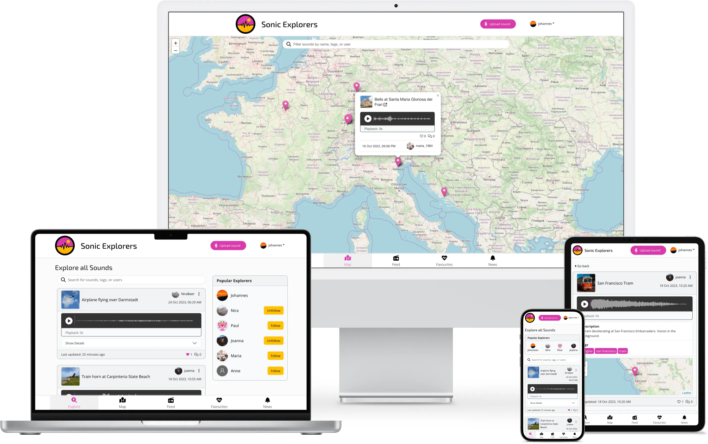
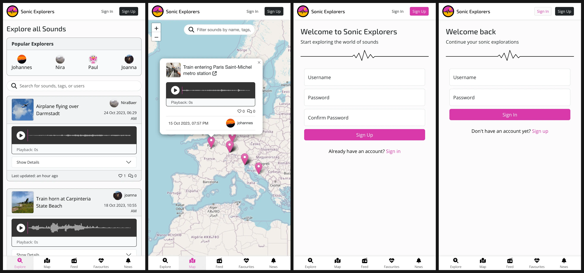
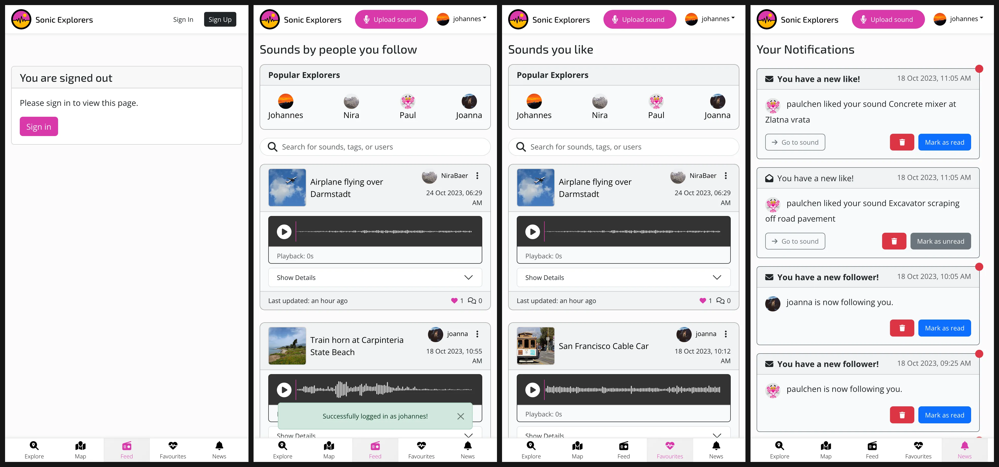
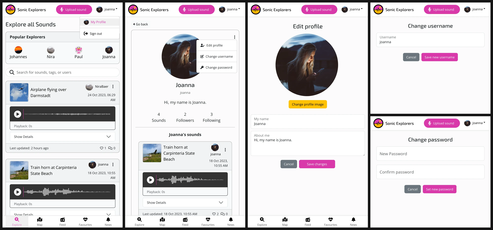
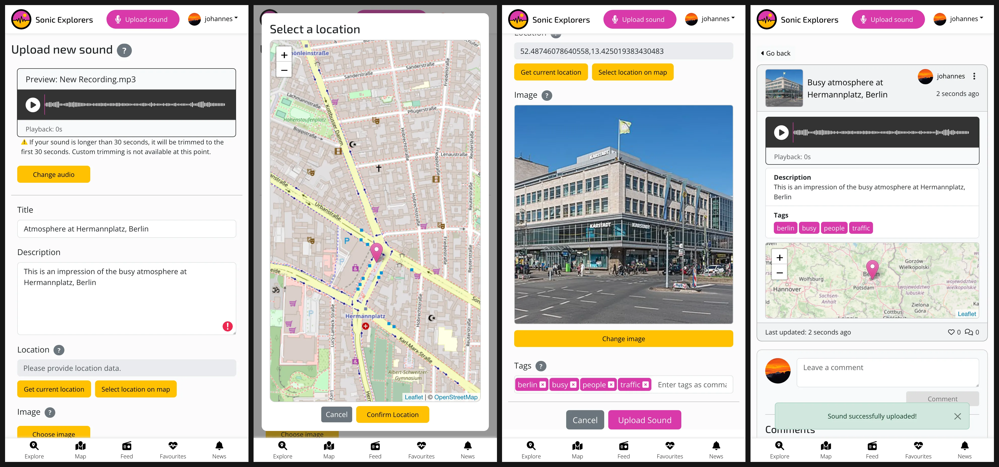
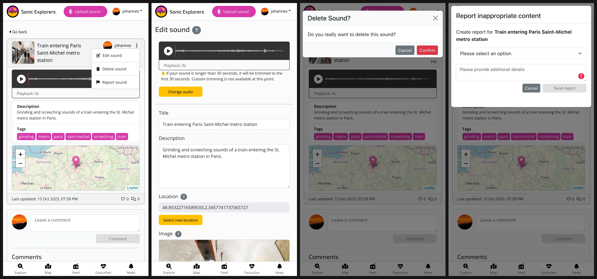
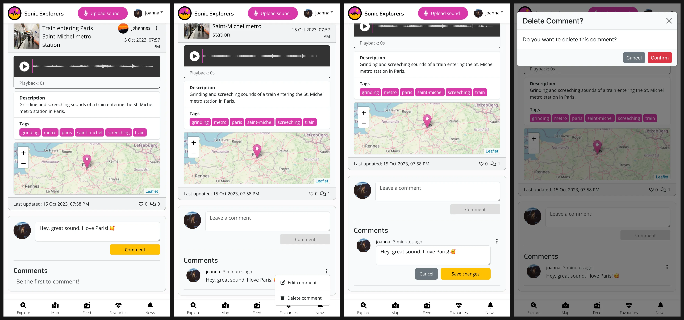
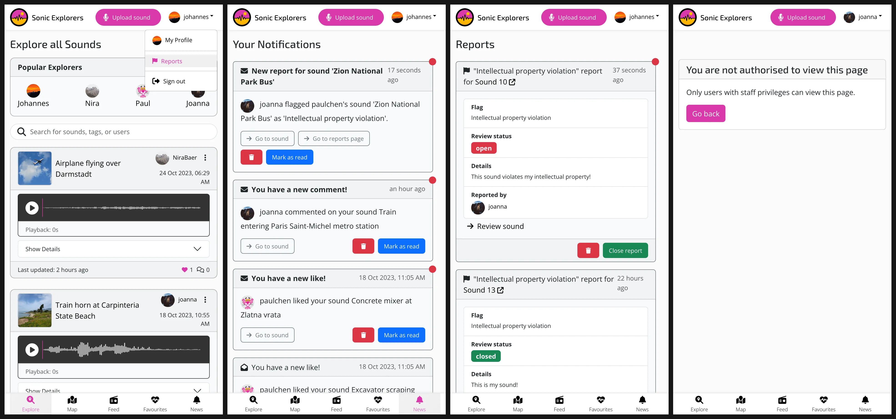
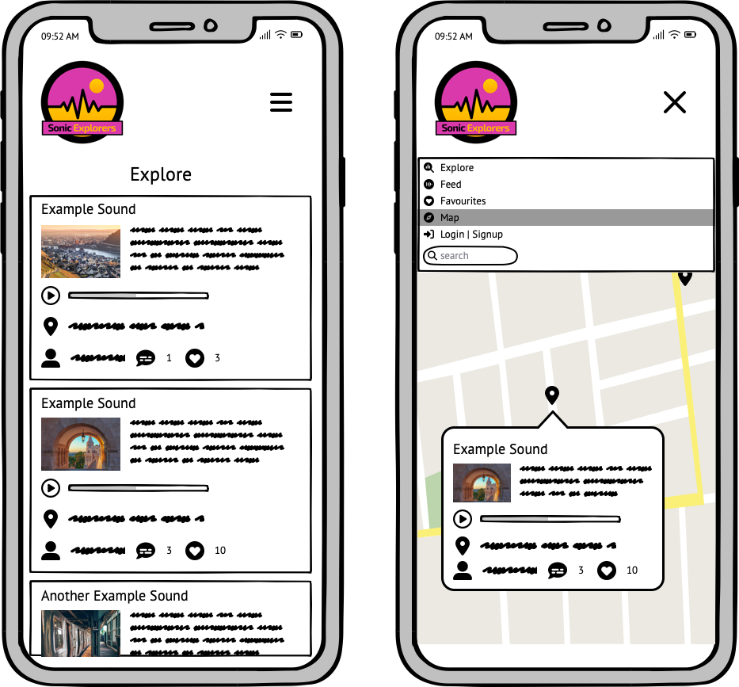
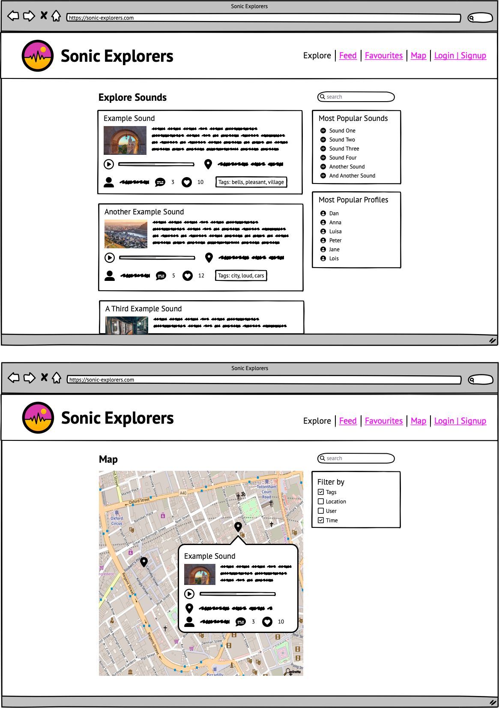

# Sonic Explorers: Listen, Share, Connect 🌎🎙️

**Sonic Explorers** is a social media app dedicated to recording and sharing sounds.

In a world saturated with images and visual content, the sounds that surround us often go unnoticed, unless they are too loud or disruptive.
**Sonic Explorers** encourages you to open up your ears and sharpen your awareness of the diverse sounds of the world.
Whether you find yourself in the busy streets of a large city or enjoying the calm serenity of nature, record the sounds you encounter and share your sonic treasures with your friends and followers.

**Key features:**

- **User Accounts & Profiles**: Create an account and customize your profile.
- **Sound Upload with Geolocation**: Share your sounds and add location data.
- **Tagging System**: Organize your sounds with tags.
- **Search for Sounds**: Find sounds by title, description, user, or tag.
- **Sound Map View**: Explore all sounds on a map.
- **User Interactions**: Like and comment on sounds, follow users you like.
- **Notifications**: Stay updated on user interactions and new content.
- **Report Inappropriate Content**: Help make the app a safe space for everyone.

The deployed application can be found here: [Sonic Explorers](https://sonic-explorers-e821805686e9.herokuapp.com/)

## Table of Contents

...

## Features

### Existing Features

- **User authentication and profiles**: Users can create an account, log in and log out. They can customize their profile by adding a profile picture and a short bio.
- **Sound upload with geolocation**: Users can upload sounds and add location data. They can also edit and delete their sounds.
- **Tagging system**: Users can add tags to their sounds.
- **Sound list view with infinite scroll**: Users can see lists of sounds (all sounds, sounds by followed users, liked sounds). For better performance the lists are paginated, and additional sounds are loaded when the user scrolls to the bottom of the page.
- **Sound search**: Users can search for sounds by title, description, user, or tag.
- **Sound map view**: Users can view all sounds on a map.
- **User interactions**: Users can like and comment on sounds. They can also follow other users.
- **Notifications**: Users receive notifications for new likes and comments on their sounds, and for new sounds by users they follow. Staff users receive notifications for new reports.
- **Reporting inappropriate content**: Users can report inappropriate content.

#### User Authentication

- Signed-out users can see a list of all sounds and search for sounds, and explore the sound map. To use the other features of the app, they need to create an account and sign in.

- After signing in, users can access their feed, their liked sounds, and their notifications from the bottom navigation bar.
- Users can also upload sounds by clicking on the upload button in the top navigation bar.

#### User Profiles

- Signed-in users can click on their username in the top navigation bar to access their profile.
- Users can edit their profile by clicking on the menu button in the top-right corner of the profile page.
- Additionally, they can change their username and password by clicking on the corresponding buttons on the profile page dropdown menu.
- Users can follow other users by clicking on the Follow button on their profile page or in the *Popular Explorers* widget (only available on larger screens).

#### Sound Upload

- Users can upload sounds by clicking on the upload button in the top navigation bar.
- On the sound upload page, users can upload a sound file and add a title, description, location data, tags, and an image to their sound.
- Users can listen to their sound before uploading it by clicking on the play button.
- Location data can be added automatically if the user grants the application access to their current location. Alternatively, users can pick a location on a map.
- Users can add up to 15 tags to their sound by entering them as comma-separated values.
- After submitting the form, the user will be redirected to the sound detail page, which can also be accessed by clicking on a sound's title.

#### Editing and Deleting Sounds

- Users can edit and delete their sounds by clicking on the dropdown menu button on the sound detail page.
- Users can also report inappropriate sounds for inappropriate content by clicking on the report button on the sound detail dropdown menu.

#### Comments and Likes

- Signed-in users can comment on sounds by submitting the comment form on the sound detail page.
- New comments will appear underneath the sound detail and can be edited or deleted by clicking on the link in the comment dropdown menu.
- The number of comments will appear underneath the sound's details.
- Users can like sounds by clicking on the heart icon on the sound detail page.

#### Reports

- Staff users can access all reports by clicking on the reports link in the user dropdown menu in the top navigation bar.
- Staff users will also receive a notification when a new report is submitted.
- Staff users can review reports and mark them as closed from the reports page.
- If non-staff users try to access the reports page by entering the URL in the browser, they will see an *access denied* message.

### Future Features

The following features have not been included in the current scope of the project, but might be added in the future:

- Users can record sounds directly in the browser instead of uploading pre-recorded sounds.
- Provide users with basic sound editing functionality like trimming, fading, etc.
- Users can search for sounds by address, city, country, or continent.
- Users can reply to comments.
- Users can send private messages to other users.
- Users can set their sounds to private or make them available only to their followers.
- Staff users can delete inappropriate content and block users.
- Gamification features:
    - Challenges for finding and recording specific sounds or going to specific places.
    - Users can earn badges for certain achievements (e.g. number of sounds uploaded, number of likes, completing challenges).

## Design Process

I approached the design process of the *Sonic Explorers* app from a user-centered perspective, following the five planes of user experience. The design process of the frontend application had to go hand in hand with the design process of the backend API, which is documented here: [Sonic Explorers API Design Process](https://github.com/sonic-explorers/sonic-explorers-api#design-process).

### Strategy Plane

*Sonic Explorers* is a social media app dedicated to recording and sharing sounds. It's target audience are people who are interested in sound and want to share their experiences with others. Its main goal is to provide a playful and engaging way of encouraging a more conscious approach to the sounds in our environment.

The use of geolocation and maps is an essential part of the application. Due to the ephemeral nature of sound, recordings often feel disconnected from the original situation in which they were recorded. Adding location data to a sound can help to link sound recordings to real places and situations, which makes it easier for users to relate to them. At the same time, placing sounds on a map allows users to explore sounds from different places and discover new sounds around them. It also encourages users to get out and explore interesting sounds in the world.

Tagging sounds is another important feature of the application. It allows users to organize and find sounds. It also encourages users to think about the acoustic qualities of the sounds they encounter and to reflect on them. Although it can be quite challenging to find appropriate words to describe a sound, other than the sound's source, thinking about this can be a first step to a more conscious approach to sound.

The social interaction features of the application (following other users, liking and commenting on sounds) are intended to encourage users to engage with each other and to create a community of people who are interested in sound.

### Scope Plane

For the scope of the project, separate sets of user stories were created for the backend and the frontend part of the application. The user stories for the Sonic Explorers API can be found here: [Sonic Explorers API User Stories](https://github.com/nacht-falter/sonic-explorers-api/blob/main/docs/USERSTORIES.md). Detailed information on the user stories for the frontend application can be found here: [Sonic Explorers User Stories](docs/USERSTORIES.md).

The following user stories were included in the current scope of the frontend project:

...

### Structure Plane

The planning of the structure plane of the project involved thinking about the different parts of the project and their interactions. Since most of that planning had to be done before implementing the backend part of the project, the process of planning the strucure of the backend (database, models, API endpoints) is documented here: [Sonic Explorers API Design Process](https://github.com/nacht-falter/sonic-explorers-api#design-process).

The structure of the frontend application was guided by the features provided by the backend API. In order to implement all features within the current scope of the project, I planned the frontend application with the following main components:

- Two navigation bars (top and bottom)
- Pages for user authentication (sign up, sign in)
- Pages for listing sounds, notifications, and reports
- Forms for uploading and editing sounds
- Pages for displaying and editing user profiles
- A page for displaying sound details
- A component for displaying a map with all sounds
- Components for displaying profiles, sound details, comments, notifications, and reports
- Forms for creating and editing profiles, comments, and reports and for changing usernames and passwords
- An audio player for listening to sounds

Additional components were added during the development process as needed.

### Skeleton Plane

The layout of the application was designed with a mobile-first approach, since it is intended to be mainly used as a mobile application. But it is also designed to be fully responsive and can be used on all screen sizes.

The user interface of the application consists of three main sections:

- A top navigation bar including the following elements:
    - The Sonic Explorers logo (and the title on larger screens)
    - Sign-up and sign-in links for signed-out users
    - A sound upload button and a user dropdown menu for signed-in users
- A bottom navigation bar with links to the main pages of the application (Explore, Map, Feed, Favourites, News)
- A content section for displaying the contents of the current page

Originally, the user interface of the application was planned with a dropdown navigation menu at the top of the page, as can be seen on the wireframes below. During the development process, I decided to use a bottom navigation bar for the main pages of the application to make the application more mobile-friendly and make it feel more like a mobile app rather than a website. This decision is not reflected in the wireframes.

Show wireframes for Mobile

Show wireframes for Desktop

### Surface Plane

#### Logo

The first step of planning for the surface plane was to design a logo for the application. After playing around with different ideas, I settled on a circle divided in two halves by a jagged line, which looks like a soundwave but also like a mountain range, representing the sound aspect as well as the exploratory aspect of the application. I chose pink and yellow as the main colors of the logo. 

#### Colors

In accordance with the application logo, the main colors of the application used for links, buttons and other elements are pink and yellow.

<!-- Display colors in markdown: https://stackoverflow.com/a/41247934 -->
 Primary color: #d939ab

 Secondary color: #ffc101

#### Fonts

I chose [Open Sans](https://fonts.google.com/specimen/Open+Sans) as the main font for the application for its clean look and good legibility. It is used for all text elements on the page except for headings.

For headings I chose [Exo 2](https://fonts.google.com/specimen/Exo+2), which has a more playful and futuristic look.
